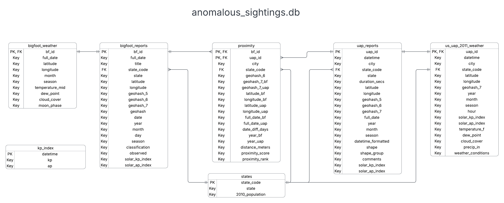

# 🛸 Anomalous Sightings Archive 🗺️

This project investigates potential correlations between Bigfoot and UFO (UAP) sightings across the United States from 1950 to 2014.  
The primary goal is to determine whether there is a meaningful relationship in the **time** and/or **location** of these anomalous phenomena, or if any clusters exist.  
Secondary goals include identifying shared environmental conditions (season, weather, KP index, etc.) and providing practical insights for independent investigators.

---

## Quick Start

```bash
git clone https://github.com/wslider/anomalous-sightings-archive.git
cd anomalous-sightings-archive
python -m venv .venv
```

**Activate the virtual environment**

**Bash** (macOS, Linux, Git Bash on Windows, WSL)
```bash
# Unix-style
source .venv/bin/activate

# Windows (Git Bash / WSL)
source .venv/Scripts/activate
```

**PowerShell** (Windows only – optional)
```powershell
.\.venv\Scripts\Activate.ps1
```

**Install the required packages** (Bash & PowerShell – same command)
```bash
pip install -r requirements.txt
```

Then open `notebooks/anomalous_sightings_analysis.ipynb` in Jupyter Notebook or JupyterLab and **Run All**.

> Tip for Windows users: Git Bash or WSL works exactly like Linux/macOS. You do **not** need PowerShell.  
> Outputs are cleared for version control. Running the notebook regenerates the dataframes, SQLite database, charts, and maps (saved to `plots/`).

---

## How to Use (Detailed)

1. Clone this repository

   ```bash
   git clone https://github.com/wslider/anomalous-sightings-archive.git
   cd anomalous-sightings-archive
   ```

2. Create and activate a virtual environment in your preferred terminal:

   **Bash** (macOS, Linux, Git Bash on Windows, WSL)
   ```bash
   python -m venv .venv
   # Unix-style
   source .venv/bin/activate
   # Windows (Git Bash / WSL)
   source .venv/Scripts/activate
   ```

   **PowerShell** (Windows only – optional)
   ```powershell
   python -m venv .venv
   .\.venv\Scripts\Activate.ps1
   ```

3. **Install the required packages** (Bash & PowerShell – same command)
   ```bash
   pip install -r requirements.txt
   ```

4. Open `notebooks/anomalous_sightings_analysis.ipynb` in Jupyter Notebook or JupyterLab and **Run All** cells.

   The notebook will:
   - Import libraries and Python modules (`python/`)
   - Read the raw data (`data/raw`)
   - Clean & enrich the data (`data/processed` → `data/final`)
     - Notebook outputs show dataframes and the full process / logic behind decisions
   - Create the SQLite DB (`sql/anomalous_sightings.db`)
   - Run SQLite queries and display dataframes
   - Generate visualizations and maps + save them to `plots/`

> All key charts and maps are saved in the `plots/` directory (see below).  
> Note: Outputs in the notebook are cleared for version control — they are recreated when you run all cells.

---

## Example Output

Key visualizations from the current analysis:

| Visualization | File |
|---------------|------|
| Histogram of temperatures at UAP & Bigfoot sightings | [`plots/bigfoot_uap_temperatures_histogram.png`](plots/bigfoot_uap_temperatures_histogram.png) |
| Cloud cover distribution across all reports | [`plots/cloud_cover_distribution_all_reports_bar.png`](plots/cloud_cover_distribution_all_reports_bar.png) |
| KP Index distribution (Historical vs Bigfoot vs UAP) | [`plots/kp_index_distribution_all_reports_bar_v2.png`](plots/kp_index_distribution_all_reports_bar_v2.png) |
| Cluster / density / proximity maps | [`plots/proximity_map.png`](plots/proximity_map.png) |
| Choropleth maps (sightings & proximity per million population) | `coming soon` |

Archived plots from earlier versions (2010–2014 UAP subset) are available in `plots/archive/`.

---

## Data Sources

### Original / Raw Data
- **UAP / UFO reports**: `data/raw/uap_original_dataset.csv` (NUFORC, originally from Kaggle – currently unavailable)
- **US population by state**: [Kaggle – US Population by State](https://www.kaggle.com/datasets/rolfhendriks/us-population-by-state-comprehensive-data)
- **Bigfoot reports**: [BFRO Database on Kaggle](https://www.kaggle.com/datasets/thedevastator/unlocking-mysteries-of-bigfoot-through-sightings?select=bfro_reports.csv)

### Processed Data (created by this project)
- **Kp Index (Geomagnetic Activity)**: [GFZ Potsdam – Kp Index](https://kp.gfz.de/)
  - Used to create `data/processed/kp_index.csv`
- **US UAP + weather (2011)**: `data/processed/sighting_with_weather_v2.csv`
  - Created via Open-Meteo API weather enrichment of 2011 US UAP sightings only

---

## Project Workflow

### Tools & Environment
- **Version Control**: GitHub  
- **IDE**: VS Code  
- **Primary Development**: Jupyter Notebooks  
- **Main Notebook**: `notebooks/anomalous_sightings_analysis.ipynb`  
- **Modular Python scripts** (`python/`):
  - Weather API integration (Open-Meteo)
  - KP Index fetching & CSV generation
  - Geohash generation + haversine distance
  - Proximity table computation

### Step-by-step Process

1. **Data Ingestion**  
   Load Bigfoot (BFRO), UAP (NUFORC), US Census population data, and generate `kp_index.csv`.

2. **Data Cleaning** (Pandas)  
   Standard cleaning, normalization, and merging of the two Bigfoot datasets into `combined_bigfoot.csv`.

3. **Data Enrichment** (Pandas)  
   - Add solar KP / AP Index  
   - Historical weather (2010–2014 UAP) via `weather_api.py` (Open-Meteo)  
   - Create proximity table by merging on `geohash_7`  
   - Reorder columns to match the ERD

4. **Relational Database** (SQLite)  
   Tables:
   - `bigfoot_reports` (PK: `bf_id`)
   - `bigfoot_weather`
   - `uap_reports` (PK: `uap_id`)
   - `us_uap_2011_weather`
   - `states` (PK: `state_code`)
   - `proximity` (composite PK: `bf_id` + `uap_id`)
   - `kp_index` (PK: `datetime`)

   

5. **Analysis**  
   SQL queries against the SQLite database to generate insights.

6. **Visualizations**  
   - Charts: Matplotlib + Seaborn  
   - Maps: GeoPandas + Folium  

7. **Stretch Goals**  
   - Choropleth maps of the contiguous United States  
   - Individual state-level charts and maps

8. **Future Plans**  
   - Interactive front-end (Streamlit dashboard or full website)  
   - User sighting submission form  
   - Cloud-hosted database with ongoing updates

---

## API Use

**Current – Open-Meteo**  
This project uses the free [Open-Meteo](https://open-meteo.com/) Historical Weather API.  
No API key is required.

The weather enrichment logic lives in `python/weather_api.py`.

**Current – Kp Index (GFZ)**  
Geomagnetic Kp index data is sourced from the official [GFZ Potsdam Kp Index service](https://kp.gfz.de/).  
No API key is required.

The fetching and processing logic lives in `python/kp_index.py`.

**Legacy (Previous Version – Not Required)**  
Older notebooks used WeatherAPI.com.  
If you want to re-run those archived notebooks:
1. Get a free key at [https://www.weatherapi.com/](https://www.weatherapi.com/)
2. Store it in a `.env` file:
   ```
   WX_API_KEY=your_key_here
   ```

---

## AI Assistance

### Archived Notebooks (`notebooks/archive/`)
- Weather API request parsing for 2010–2014 UAP data (Grok 4)
- UAP state choropleth map creation (Grok 4)

### Main Notebook (`notebooks/anomalous_sightings_analysis.ipynb`)
- `state_to_code` dictionary generation (Grok 4)
- Handling of `24:00` datetime edge cases (Grok 4)
- Primary key setup in SQLite (Grok 4)
- Weather API loop + checkpoints (Open-Meteo) (Grok 4)
- Cloud cover CTE (`CASE` statement) (Grok 4)
- Grouped bar chart of cloud cover distribution (Grok 4)
- Axis of Contiguous US Plot Map in State Population Weighted Plot Map of US UAP Sightings (Contiguous 48 States Only)

### Python Modules (`python/`)
- `kp_index.py` – datetime parsing (Grok 4)
- `geo_location.py` – `create_geohashes` + `haversine_distance` (Grok 4)
- `weather_api.py` – error handling + vectorized weather condition classification (Grok 4)

### README.md
- Example Output Section with Links to Plots (Grok 4)
- Typo / Spellchecking & Final Polish (Grok 4)

---

## Author
**William Slider** – Data Analyst

---

## License

MIT License